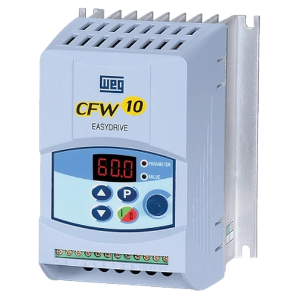
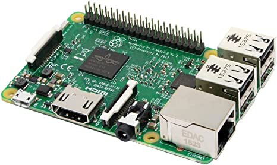

## Controle de inversor de frequência com Python e Kivy

Este trabalho foi desenvolvido na disciplina de **Sistemas embarcados II** durante a graduação em Engenharia Mecatrônica :robot: :zap: :computer:.

Neste repositório estão contidos os códigos resposáveis pelo controle de um inversor de frequência Weg (modelo CFW10), através de um Raspberry PI 3.

    
    

### Desenvolvimento
A interface gráfica utilizada foi desenvolvida em Python com a utilização do framework [Kivy](https://kivy.org/doc/stable/guide/basic.html). O software possibilita através do inversor de frequência, os seguintes comandos:

- Acionamento e parada de motor de potência
- Configuração da velocidade de rotação do motor (analógico/digital)
- Sentido de giro do motor

    

&nbsp;

    
    

